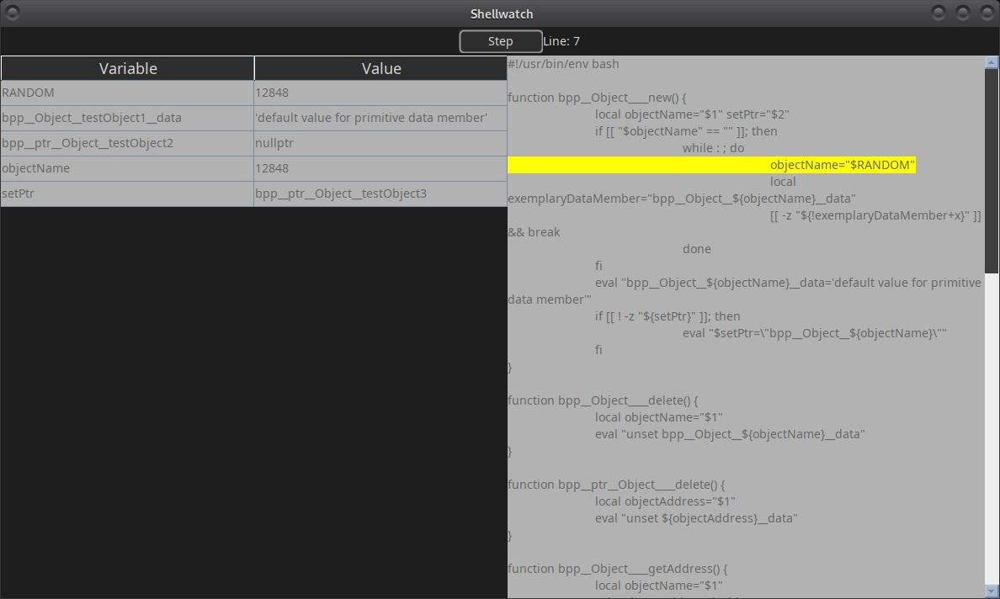

# shellwatch

Keeps a watch on shell variable assignments throughout the execution of a given script

```sh
shellwatch {SCRIPT-FILE}
```

Will step the program line-by-line, and display a window containing a list of variable names and the values assigned to them after each line



Pressing the `step` button will execute the next line of the script. Each step will update the variable list.

Checking the `auto-step` checkbox will automatically step through the script, updating the variable list after each line. You can adjust the speed of the auto-step by modifying the `delay` input. By default, the delay is set to 1 second.

You can modify the values of the variables in the list by clicking on the value in the table and typing in a new value. Pressing `enter` will update the variable with the new value. This new value will be passed to the script when the next line is executed.

Pressing the `terminate` button will stop the script and close the window.