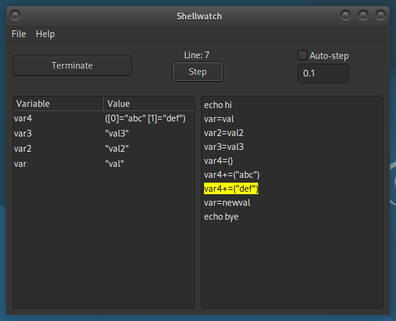

# shellwatch

Keeps a watch on shell variable assignments throughout the execution of a given script

```sh
shellwatch {SCRIPT-FILE}
```

Will step the program line-by-line, and display a window containing a list of variable names and the values assigned to them after each line



Pressing the <kbd>Step</kbd> button will execute the next line of the script. Each step will update the variable list.

Checking the <kbd>Auto-step</kbd> checkbox will automatically step through the script, updating the variable list after each line. You can adjust the speed of the auto-step by modifying the `delay` input. By default, the delay is set to `0.1` seconds.

Pressing the <kbd>Terminate</kbd> button will stop the script and clear the variable list.
